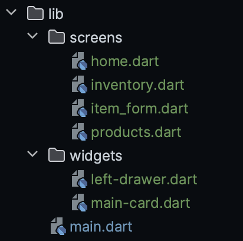

# Identitas
Nama                : Yasmine Putri Viryadhani<br>
NPM                 : 2206081862<br>
Kelas               : PBP A<br>
Nama App            : ultr4milk<br>

# Latar Belakang:
- Saya membuat program Flutter bertema inventory susu Ultra Milk karena barang yang diinventorikan hanyalah susu Ultra Milk (homogen).
- Belakangan ini, Ultra Milk berkolaborasi dengan [**Stray Kids**](https://en.wikipedia.org/wiki/Stray_Kids) untuk iklan terbarunya
- Jika pengguna meraih poin tertentu, mereka dapat menukarkan poin dengan photocard digital Ultra Milk x Stray Kids

# Tampilan Aplikasi:
- Tugas 8:
    


# Checklist
## Checklist Tugas 7
<details>
<summary>Spoiler</summary>

## ✅ Membuat sebuah program Flutter baru dengan tema inventory seperti tugas-tugas sebelumnya.
- Setelah setup dan instalasi Flutter, kita membuat program Flutter dengan cara:
    ```
    flutter create ultr4milk
    cd ultr4milk
    ```
- Untuk menjalankan app, kita jalankan <code>flutter run</code> di Terminal

## ✅ Membuat tiga tombol sederhana dengan ikon dan teks untuk Lihat Item, Tambah Item, dan Logout
- Saya membuat empat tombol, yaitu Purchase, Add Item (Tambah Item), Logout, dan Inventory (Lihat Item)
- Kode lengkap bisa dilihat di [sini](https://github.com/sdikyarts/ultr4milk/blob/main/ultr4milk/lib/home.dart) di atas

## ✅ Memunculkan Snackbar dengan tulisan "Kamu telah menekan tombol XXX"
- Untuk membuat itu, saya memakai syntax ini:
    ```
    return InkWell(
        onTap: () {
            final message = "You pressed ${item.name} button!";
            ScaffoldMessenger.of(context)
            ..hideCurrentSnackBar()
            ..showSnackBar(SnackBar(
                content: Text(message)));
    },
    ```
</details>

## Checklist Tugas 8
<details>
<summary>Spoiler</summary>

## ✅ Membuat minimal satu halaman baru pada aplikasi, yaitu halaman formulir tambah item baru dengan ketentuan sebagai berikut:
### - Memakai minimal tiga elemen input, yaitu name, amount, description.

- Saya membuat total tiga page baru (kode lengkap bisa ditekan): 
    - [<code>item_form</code>](https://github.com/sdikyarts/ultr4milk/blob/main/ultr4milk/lib/screens/item_form.dart) (untuk halaman formulir) dengan empat elemen input:
        - name (wajib)
        - price
        - amount (wajib)
        - description (wajib)
    - [<code>inventory</code>](https://github.com/sdikyarts/ultr4milk/blob/main/ultr4milk/lib/screens/inventory.dart) (tombol opsi lihat produk atau photocard) [DALAM PENGEMBANGAN]
    - [<code>products</code>](https://github.com/sdikyarts/ultr4milk/blob/main/ultr4milk/lib/screens/products.dart) (list produk yang telah ditambahkan ke form)

### - Memiliki sebuah tombol Save.
- Potongan kode di <code>item_form</code> ini digunakan untuk membuat tombol save beserta validasi saat menekan tombol save:
    ```
    Align(
        alignment: Alignment.bottomCenter,
        child: Padding(
            padding: const EdgeInsets.all(8.0),
            child: InkWell(
                onTap: () {
                if (_formKey.currentState!.validate()) {
                    void updateProductPage(List<Item> updatedItems) {
                    Navigator.of(context).push(
                        MaterialPageRoute(
                        builder: (context) => ProductPage(items: updatedItems),
                        ),
                    );
                    }
                    // Buat objek item baru
                    Item newItem = Item(_name, _price, _amount, _description);

                    // Tambahkan item ke list
                    items.add(newItem);

                    // Match nama produk dengan gambar
                    _imageFilename = Match.matchName(_name);

                    // Update total points based on some logic
                    int calculatedPoints = PointCount()._calculatePoints(_amount, _price, _name);
                    Points.totalPoints += calculatedPoints;

                    // Call the callback function to update the total points in Home
                    widget.updateTotalPoints(calculatedPoints);

                    // Update ProductPage
                    updateProductPage(items);

                    showDialog(
                    context: context,
                    builder: (context) {
                        return AlertDialog(
                        title: const Text(
                            'Successfully added item!',
                            style: TextStyle(
                            fontWeight: FontWeight.w700,
                            ),
                        ),
                        content: SingleChildScrollView(
                            child: Column(
                            crossAxisAlignment: CrossAxisAlignment.start,
                            children: [
                                Text('Nama: $_name'),
                                // TODO: Munculkan value-value lainnya
                                Text('Harga: $_price'),
                                Text('Stok: $_amount'),
                                Text('Deskripsi: $_description'),

                                // Display the image filename
                                Text('Image Filename: $_imageFilename'),
                            ],
                            ),
                        ),
                        contentPadding: EdgeInsets.fromLTRB(24, 16, 24, 0), // Adjust top and bottom padding
                        backgroundColor: Color(0xFFF4F0FF),
                        shape: RoundedRectangleBorder(
                            borderRadius: BorderRadius.circular(16.0), // Adjust border radius
                        ),
                        actions: [
                            Padding(
                            padding: const EdgeInsets.symmetric(horizontal: 24, vertical: 16), // Adjust horizontal and vertical padding for the button
                            child: TextButton(
                                child: const Text(
                                'OK',
                                style: TextStyle(
                                    color: Colors.white,
                                    fontWeight: FontWeight.w700,
                                ),
                                ),
                                onPressed: () {
                                Navigator.pop(context);
                                },
                                style: ButtonStyle(
                                backgroundColor: MaterialStateProperty.all(Color(0xFF37B989)),
                                ),
                            ),
                            ),
                        ],
                        );
                    },
                    );
                }
                _formKey.currentState!.reset();
                },

                child: Container(
                height: 35,
                width: 110,
                decoration: BoxDecoration(
                    color: Color(0xFF37B989),
                    borderRadius: BorderRadius.circular(10),
                ),
                child: Center(
                    child: Text(
                    "Add Item",
                    textAlign: TextAlign.center,
                    style: TextStyle(
                        color: Colors.white,
                        fontSize: 18,
                        fontWeight: FontWeight.w700,
                    ),
                    ),
                ),
                )
            ),
        ),
        ),
    ```

### - Setiap elemen input di formulir juga harus divalidasi dengan ketentuan tidak boleh kosong dan harus berisi data dengan tipe data atribut modelnya
- Untuk name:
    ```
    Padding(
        padding: const EdgeInsets.all(8.0),
        child: 
            Container(
                decoration: BoxDecoration(
                color: Color(0xFFCCC3E1),
                borderRadius: BorderRadius.circular(10.0),
                ),
                child: TextFormField(
                decoration: InputDecoration(
                    hintText: "Product Name",
                    focusedBorder: OutlineInputBorder(
                    borderRadius: BorderRadius.circular(10.0),
                    borderSide: BorderSide(
                        color: Colors.blue, // Customize the color for focused border
                    ),
                    ),
                    enabledBorder: OutlineInputBorder(
                    borderRadius: BorderRadius.circular(10.0),
                    borderSide: BorderSide.none, // Remove border for enabled state
                    ),
                ),
                onChanged: (String? value) {
                    setState(() {
                    _name = value!;
                    });
                },
                validator: (String? value) {
                    if (value == null || value.isEmpty) {
                    return "Name cannot be empty!";
                    }
                    return null;
                },
                ),
            ),
        ),
    ```
- Untuk price:
    ```
    Padding(
        padding: const EdgeInsets.all(8.0),
        child: 
            Container(
                decoration: BoxDecoration(
                    color: Color(0xFFCCC3E1),
                    borderRadius: BorderRadius.circular(10.0),
                ),
                child: TextFormField(
                    decoration: InputDecoration(
                    hintText: "Price",
                    focusedBorder: OutlineInputBorder(
                        borderRadius: BorderRadius.circular(10.0),
                        borderSide: BorderSide(
                        color: Colors.blue, // Customize the color for focused border
                        ),
                    ),
                    enabledBorder: OutlineInputBorder(
                        borderRadius: BorderRadius.circular(10.0),
                        borderSide: BorderSide.none, // Remove border for enabled state
                    ),
                    ),
                    onChanged: (String? value) {
                    setState(() {
                        _price = int.parse(value!);
                    });
                    },
                    validator: (String? value) {
                    if (value == null || value.isEmpty) {
                        return "Price cannot be empty!";
                    }
                    if (int.tryParse(value) == null) {
                        return "Price must be in digits!";
                    }
                    return null;
                    },
                )
            ),
        ),
    ```
- Untuk amount:
    ```
    Padding(
        padding: const EdgeInsets.all(8.0),
        child: 
            Container(
                decoration: BoxDecoration(
                color: Color(0xFFCCC3E1),
                borderRadius: BorderRadius.circular(10.0),
                ),
                child: TextFormField(
                decoration: InputDecoration(
                    hintText: "Amount",
                    focusedBorder: OutlineInputBorder(
                    borderRadius: BorderRadius.circular(10.0),
                    borderSide: BorderSide(
                        color: Colors.blue, // Customize the color for focused border
                    ),
                    ),
                    enabledBorder: OutlineInputBorder(
                    borderRadius: BorderRadius.circular(10.0),
                    borderSide: BorderSide.none, // Remove border for enabled state
                    ),
                ),
                onChanged: (String? value) {
                    setState(() {
                    _amount = int.parse(value!);
                    });
                },
                validator: (String? value) {
                    if (value == null || value.isEmpty) {
                    return "Volume cannot be empty!";
                    }
                    if (int.tryParse(value) == null) {
                    return "Volume must be in digits!";
                    }
                    return null;
                },
                ),
            ),
        ),
    ```
- Untuk description:
    ```
    Padding(
        padding: const EdgeInsets.all(8.0),
        child: 
            Container(
                decoration: BoxDecoration(
                color: Color(0xFFCCC3E1),
                borderRadius: BorderRadius.circular(10.0),
                ),
                child: TextFormField(
                decoration: InputDecoration(
                    hintText: "Description",
                    focusedBorder: OutlineInputBorder(
                    borderRadius: BorderRadius.circular(10.0),
                    borderSide: BorderSide(
                        color: Colors.blue, // Customize the color for focused border
                    ),
                    ),
                    enabledBorder: OutlineInputBorder(
                    borderRadius: BorderRadius.circular(10.0),
                    borderSide: BorderSide.none, // Remove border for enabled state
                    ),
                ),
                onChanged: (String? value) {
                    setState(() {
                    _description = value!;
                    });
                },
                validator: (String? value) {
                    if (value == null || value.isEmpty) {
                    return "Description cannot be empty!";
                    }
                    return null;
                },
                ),
            ),
        ),
    ```


## ✅ Mengarahkan pengguna ke halaman form tambah item baru ketika menekan tombol Tambah Item pada halaman utama.
- Saya mengimplementasi ini:
    ```
    onTap: () {
        if (name == "Add Items") {
          Navigator.push(
            context,
            MaterialPageRoute(builder: (context) => FormPage(updateTotalPoints: (int ) {  },)),
          );
        } else if (name == "Inventory") {
          Navigator.push(
            context,
            MaterialPageRoute(builder: (context) => Inventory(items: [],)),
          );
        }
      },
    ```

## ✅ Memunculkan data sesuai isi dari formulir yang diisi dalam sebuah pop-up setelah menekan tombol Save pada halaman formulir tambah item baru.
- Cara implementasi telah disebutkan di bagian tombol Save, yaitu pada bagian ini:
    ```
    showDialog(
        context: context,
        builder: (context) {
            return AlertDialog(
            title: const Text(
                'Successfully added item!',
                style: TextStyle(
                fontWeight: FontWeight.w700,
                ),
            ),
            content: SingleChildScrollView(
                child: Column(
                crossAxisAlignment: CrossAxisAlignment.start,
                children: [
                    Text('Nama: $_name'),
                    // TODO: Munculkan value-value lainnya
                    Text('Harga: $_price'),
                    Text('Stok: $_amount'),
                    Text('Deskripsi: $_description'),

                    // Display the image filename
                    Text('Image Filename: $_imageFilename'),
                ],
                ),
            ),
            contentPadding: EdgeInsets.fromLTRB(24, 16, 24, 0), // Adjust top and bottom padding
            backgroundColor: Color(0xFFF4F0FF),
            shape: RoundedRectangleBorder(
                borderRadius: BorderRadius.circular(16.0), // Adjust border radius
            ),
            actions: [
                Padding(
                padding: const EdgeInsets.symmetric(horizontal: 24, vertical: 16), // Adjust horizontal and vertical padding for the button
                child: TextButton(
                    child: const Text(
                    'OK',
                    style: TextStyle(
                        color: Colors.white,
                        fontWeight: FontWeight.w700,
                    ),
                    ),
                    onPressed: () {
                    Navigator.pop(context);
                    },
                    style: ButtonStyle(
                    backgroundColor: MaterialStateProperty.all(Color(0xFF37B989)),
                    ),
                ),
                ),
            ],
            );
        },
        );
    ```

## ✅ Membuat sebuah drawer pada aplikasi dengan ketentuan sebagai berikut:
### - Drawer minimal memiliki dua buah opsi, yaitu Halaman Utama dan Tambah Item.
- Dapat dibaca lebih lanjut di sini

### - Ketika memiih opsi Halaman Utama, maka aplikasi akan mengarahkan pengguna ke halaman utama.
- Implementasi:
    ```
    // Routing Home
    ListTile(
        leading: const Icon(
        Icons.home_rounded,
        color: Color(0xFF2E2C34),
        size: 30,
        ),
        title: const Text(
            'Home',
            style: TextStyle(
            color: Color(0xFF0E0818),
            fontSize: 20,
            fontWeight: FontWeight.bold,
            )
        ),
        // Bagian redirection ke MyHomePage
        onTap: () {
        Navigator.pushReplacement(
            context,
            MaterialPageRoute(
                builder: (context) => Home(),
            ));
        },
    ),
    ```

### - Ketika memiih opsi (Tambah Item), maka aplikasi akan mengarahkan pengguna ke halaman form tambah item baru.
- Implementasi:
    ```
    // Routing Home
    ListTile(
        leading: const Icon(
        Icons.plus_one_rounded,
        color: Color(0xFF2E2C34),
        size: 30,
        ),
        title: const Text(
            'Add Items',
            style: TextStyle(
            color: Color(0xFF0E0818),
            fontSize: 20,
            fontWeight: FontWeight.bold,
            )
        ),
        // Bagian redirection ke MyHomePage
        onTap: () {
        Navigator.pushReplacement(
            context,
            MaterialPageRoute(
                builder: (context) => FormPage(updateTotalPoints: (int ) {  },),
            ));
        },
    ),
    ```

## BONUS
### ✅ Membuat sebuah halaman baru, yaitu halaman daftar item yang sudah dibuat dengan isi halamannya adalah setiap data produk yang sudah pernah dibuat.
- Halaman yang saya buat adalah <code>products</code>
- Setiap kali user menekan tombol add product, redirect ke <code>products</code> dengan menampilkan list barang yang baru

### ✅ Mengarahkan pengguna ke halaman tersebut jika menekan tombol Lihat Produk pada halaman utama atau drawer.
- Saya membuat model Item di <code>item_form</code>
    ```
    class Item {
        final String name;
        final int price;
        final int amount;
        final String description;

        Item(this.name, this.price, this.amount, this.description);
    }
    ```
- Di Align(), saya membuat instance objek Item baru saat menekan tombol:
    ```
    onTap: () {
        if (_formKey.currentState!.validate()) {
            void updateProductPage(List<Item> updatedItems) {
            Navigator.of(context).push(
                MaterialPageRoute(
                builder: (context) => ProductPage(items: updatedItems),
                ),
            );
            }
            // Buat objek item baru
            Item newItem = Item(_name, _price, _amount, _description);

            // Tambahkan item ke list
            items.add(newItem);

            // Match nama produk dengan gambar
            _imageFilename = Match.matchName(_name);

            // Update total points based on some logic
            int calculatedPoints = PointCount()._calculatePoints(_amount, _price, _name);
            Points.totalPoints += calculatedPoints;

            // Call the callback function to update the total points in Home
            widget.updateTotalPoints(calculatedPoints);

            // Update ProductPage
            updateProductPage(items);

            showDialog(
                // Kode yang ada
            );
        }
        _formKey.currentState!.reset();
    },
    ```
- Navigasi belum disetting, tapi sudah muncul listnya


</details>


# Pertanyaan
## Pertanyaan Tugas 7
<details>
<summary>Spoiler</summary>

### 1. Apa perbedaan utama antara stateless dan stateful widget dalam konteks pengembangan aplikasi Flutter?
<details>
<summary>Show Answer</summary>

Dalam pengembangan aplikasi Flutter, perbedaan utama antara stateless dan stateful widget terletak pada kemampuan untuk mempertahankan dan mengubah data atau keadaan (state). Stateless widget adalah komponen tampilan yang tidak memiliki keadaan internal dan bersifat statis, artinya tampilan yang dibuat oleh widget ini tidak dapat berubah sepanjang siklus hidupnya. Sementara itu, stateful widget memiliki kemampuan untuk menyimpan dan memperbarui keadaan internal, sehingga tampilan yang dibuatnya dapat berubah sesuai dengan perubahan data atau interaksi pengguna. Sebagai contoh, tombol dengan teks yang dapat berubah berdasarkan tindakan pengguna akan menggunakan stateful widget, sementara ikon tetap atau teks statis akan menggunakan stateless widget.
</details>

### 2. Sebutkan seluruh widget yang kamu gunakan untuk menyelesaikan tugas ini dan jelaskan fungsinya masing-masing.
<details>

- Scaffold: Widget ini berfungsi untuk membuat tampilan dasar yang biasanya digunakan untuk membuat tampilan aplikasi yang berisi beberapa komponen seperti appbar, body, dan floating action button.
- Container: Widget ini berfungsi untuk membuat tampilan kotak yang dapat diatur ukurannya, seperti margin, padding, dan sebagainya.
- Column: Widget ini berfungsi untuk membuat tampilan kolom yang dapat diatur ukurannya, seperti margin, padding, dan sebagainya.
- Row: Widget ini berfungsi untuk membuat tampilan baris yang dapat diatur ukurannya, seperti margin, padding, dan sebagainya.
- Text: Widget ini berfungsi untuk membuat tampilan teks yang dapat diatur ukurannya, seperti margin, padding, dan sebagainya.
- InkWell: Widget ini berfungsi untuk membuat tampilan yang dapat diinteraksi dengan pengguna, seperti menekan tombol.
- Padding: Widget ini berfungsi untuk membuat tampilan yang dapat diatur ukurannya, seperti margin, padding, dan sebagainya.
- Image: Widget ini berfungsi untuk membuat tampilan gambar yang dapat diatur ukurannya, seperti margin, padding, dan sebagainya.
- Icon: Widget ini berfungsi untuk membuat tampilan ikon yang dapat diatur ukurannya, seperti margin, padding, dan sebagainya.
- SizedBox: Widget ini berfungsi untuk membuat tampilan kotak yang dapat diatur ukurannya, seperti margin, padding, dan sebagainya.
<summary>Show Answer</summary>
</details>

### 3. Jelaskan bagaimana cara kamu mengimplementasikan checklist di atas secara step-by-step (bukan hanya sekadar mengikuti tutorial).
Baca bagian Checklist Tugas 7 di atas
</details>

## Pertanyaan Tugas 8
<details>
<summary>Spoiler</summary>

### 1. Jelaskan perbedaan antara Navigator.push() dan Navigator.pushReplacement(), disertai dengan contoh mengenai penggunaan kedua metode tersebut yang tepat!
<details>
<summary>Show Answer</summary>

- Method push() menambahkan suatu route ke dalam stack route yang dikelola oleh Navigator. Method ini menyebabkan route yang ditambahkan berada pada paling atas stack, sehingga route yang baru saja ditambahkan tersebut akan muncul dan ditampilkan kepada pengguna.
    ```
    ...
    if (item.name == "Tambah Produk") {
        Navigator.push(context,
            MaterialPageRoute(builder: (context) => const ShopFormPage()));
    }
    ...
    ```
- Method pushReplacement() menghapus route yang sedang ditampilkan kepada pengguna dan menggantinya dengan suatu route. Method ini menyebabkan aplikasi untuk berpindah dari route yang sedang ditampilkan kepada pengguna ke suatu route yang diberikan. Pada stack route yang dikelola Navigator, route lama pada atas stack akan digantikan secara langsung oleh route baru yang diberikan tanpa mengubah kondisi elemen stack yang berada di bawahnya.
    ```
    ...
    onTap: () {
        Navigator.pushReplacement(
        context,
        MaterialPageRoute(
            builder: (context) => MyHomePage(),
        ));
    },
    ...
    ```
</details>

### 2. Jelaskan masing-masing layout widget pada Flutter dan konteks penggunaannya masing-masing!
<details>
<summary>Show Answer</summary>

1. Container
    - Widget ini memungkinkan penempatan widget lain di dalamnya dan memberikan kontrol terhadap berbagai properti seperti padding, margin, dekorasi, dan transformasi. Kontainer sering digunakan untuk mengatur tata letak dan gaya visual widget lain.
2. Column
    - Column mengatur widget secara vertikal dari atas ke bawah. Cocok untuk menempatkan widget dalam susunan vertikal, seperti daftar atau tata letak komponen UI yang berurutan dari atas ke bawah.
3. Row
    - Sebaliknya, Row mengatur widget secara horizontal dari kiri ke kanan. Ini berguna untuk menyusun elemen-elemen UI secara horizontal, misalnya, ikon di sebelah teks atau tombol dalam satu baris.
4. Stack
    - Widget ini memungkinkan tata letak widget di atas satu sama lain. Stack digunakan ketika Anda ingin meletakkan widget di atas widget lain, seperti menempatkan ikon di atas gambar atau membuat tumpukan lapisan pada UI.
5. ListView
    - ListView digunakan ketika Anda memiliki daftar item yang panjang atau variabel dan ingin membuat daftar scrollable. Ini memungkinkan pengguna untuk melihat lebih banyak item daripada yang bisa ditampilkan pada layar sekaligus.
6. GridView
    - GridView memungkinkan tata letak elemen-elemen dalam bentuk grid, baik horizontal maupun vertikal. Ini sangat berguna untuk menampilkan koleksi item dalam bentuk grid, seperti galeri foto atau aplikasi e-commerce.

</details>

### 3. Sebutkan apa saja elemen input pada form yang kamu pakai pada tugas kali ini dan jelaskan mengapa kamu menggunakan elemen input tersebut!
<details>
<summary>Show Answer</summary>

- name = untuk display nama produk yang dijual
- price = untuk display harga produk yang dijual
- amount = untuk display jumlah produk yang dijual
- description = untuk menjelaskan deskripsi produk
</details>

### 4. Bagaimana penerapan clean architecture pada aplikasi Flutter?
<details>
<summary>Show Answer</summary>

Clean Architecture adalah pendekatan pengembangan perangkat lunak yang menekankan pemisahan konsep dan tanggung jawab antara lapisan-lapisan dalam aplikasi. Di Flutter, Clean Architecture diterapkan dengan membagi aplikasi menjadi tiga lapisan utama: lapisan presentasi (UI), lapisan domain (logika bisnis), dan lapisan data (sumber data eksternal). Lapisan presentasi berisi UI dan logika tampilan, lapisan domain memiliki aturan bisnis, sedangkan lapisan data berinteraksi dengan sumber data eksternal seperti API atau database. Setiap lapisan saling terpisah dan tergantung pada abstraksi, memungkinkan perubahan pada satu lapisan tanpa mempengaruhi lapisan lainnya. Di Flutter, ini dapat diwujudkan dengan menggunakan widget untuk lapisan presentasi, class untuk lapisan domain, dan repository/provider untuk lapisan data, serta memastikan bahwa ketergantungan antar lapisan diatur dengan baik menggunakan konsep seperti Dependency Injection atau Provider.
</details>

### 3. Jelaskan bagaimana cara kamu mengimplementasikan checklist di atas secara step-by-step (bukan hanya sekadar mengikuti tutorial).
Baca bagian Checklist Tugas 7 di atas
</details>